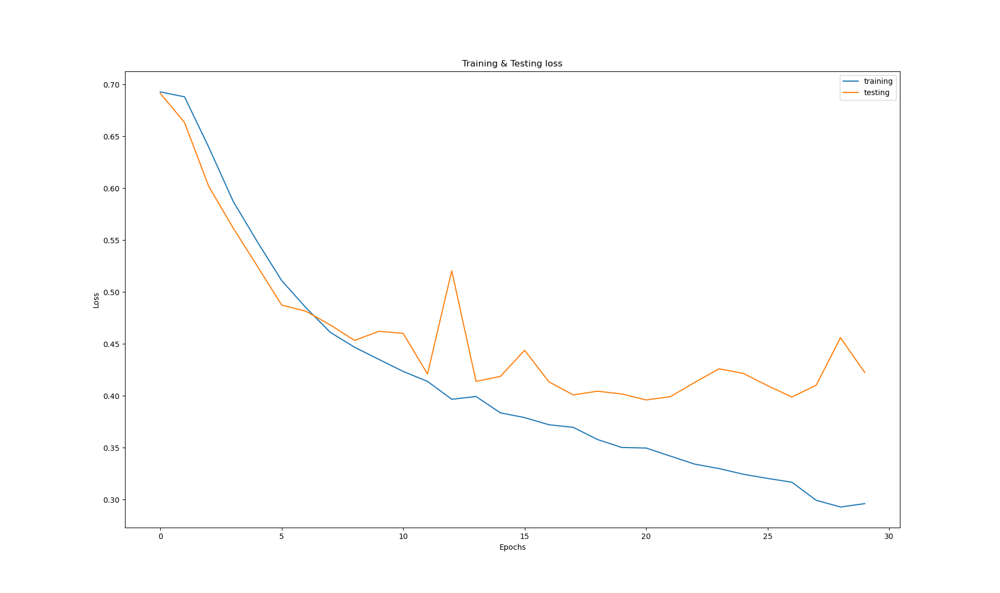
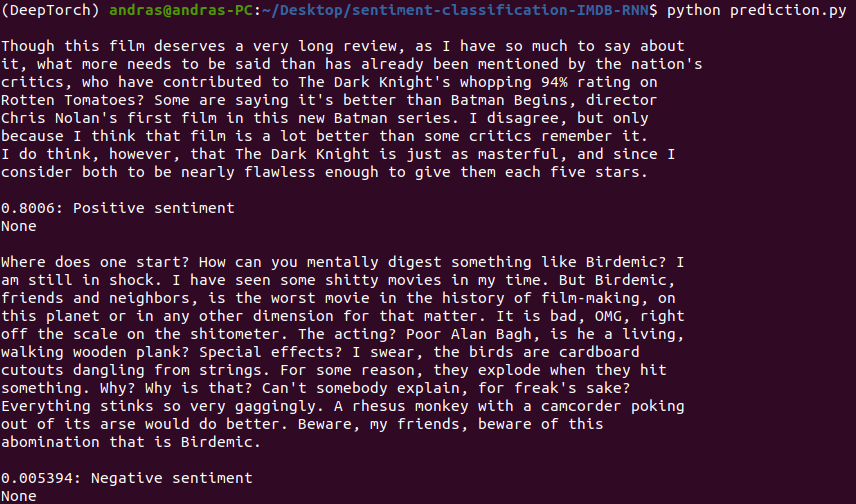

### Sentiment Classification with RNN architecture, GloVe 50-d embedding layer

This project is a follow-up of the "simpler" approach in the [other repository](https://github.com/andrasnagy-data/sentiment-classification-IMDB).
The words' semantics are represented in continuous space, and the architecture is based on pytorch's GRU (faster to train, than other RNNs)

Implemented the "early stopping" technique to address over-fitting. During the training, the best parameters were saved, and during prediction, the model class (from utils.py) was fitted with the saved parameters (state_dict).

Below one can see the model's prediction of 2 reviews.
1 positive and 1 negative. The reviews were taken from the internet, as to simulate the real-world (unseen data).

