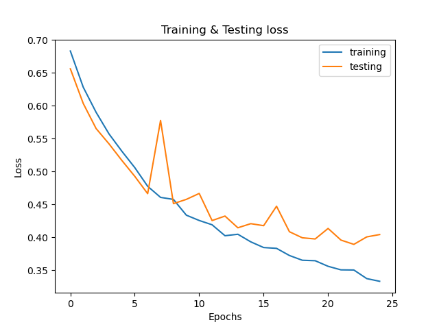

### Sentiment Classification with RNN architecture, GloVe 50-d embedding layer

This project is a follow-up of the "simpler" approach in the other repository.
The words are represented in continuous space, and the architecture is based on pytorch's GRU (faster to train, than other RNNs)

The best point to stop the training is after the 17th epoch (lowest testing error).From that point, the testing loss stops decreasing.

Below one can see the (over-fitted) model's prediction of 2 reviews.
1 positive and 1 negative. The reviews were taken from the internet, as to simulate the real-world (unseen data).

